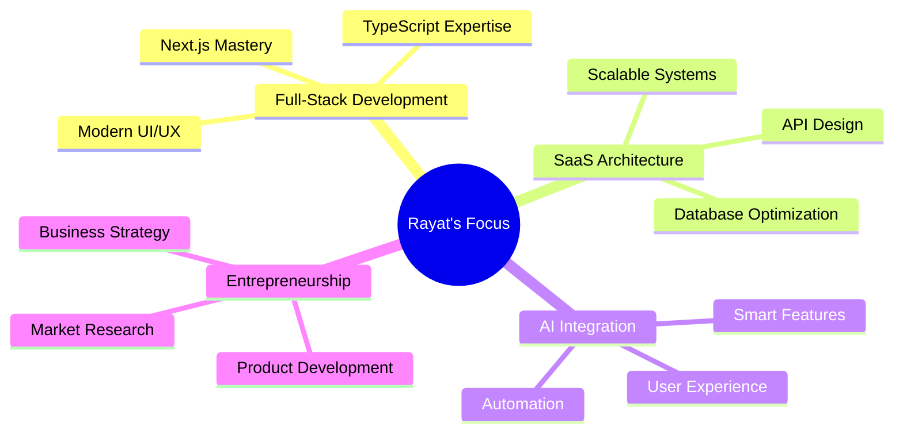

# Hi there, I'm Rayat 👋

<div align="center">
  
</div>

---

## 🚀 About Me

I'm a passionate **Computer Science Engineering student** at **United International University** with a clear vision: **becoming a tech entrepreneur** who creates impactful solutions. Currently building my way toward that goal, one line of code at a time.

```typescript
const rayat = {
  location: "Dhaka, Bangladesh",
  education: "CSE @ United International University",
  currentFocus: ["Full-Stack Development", "SaaS Solutions", "AI Integration"],
  entrepreneurialGoal: "Building scalable tech solutions that matter",
  lifePhilosophy: "Code with purpose, dream without limits"
}
```

---

## 💼 Featured Projects

<div align="center">

### 🎮 **Cyber Play Arena**
*Modern Console Gaming Center Management System*

[](your-demo-link)
[](your-repo-link)

**Tech Stack:** Next.js • TypeScript • Tailwind CSS • Prisma • PostgreSQL

---

### 💰 **TuitionTrack**
*Complete Tuition Center Management Solution for Bangladesh*

[](your-repo-link)

**Features:** Student Management • Attendance Tracking • Fee Management
**Tech Stack:** React • Node.js • Firebase • REST APIs

---

### 💸 **SpendoFrontend**
*Smart Budget Management Interface*

[](your-repo-link)

**Tech Stack:** React • Tailwind CSS • Chart.js

---

### 💌 **Dear-U**
*[Your project description here]*

[](your-repo-link)

</div>

---

## 🛠️ Tech Arsenal

<div align="center">

### **Languages & Frameworks**


### **Styling & Design**


### **Backend & Database**


### **Tools & Deployment**


</div>

---

## 📊 GitHub Analytics

<div align="center">
  
  
</div>

<div align="center">
  
</div>

---

## 🎯 Current Focus Areas



---

## 🌟 What Drives Me

> **"I believe in building technology that doesn't just work, but works for people."**

- 🎯 **Vision**: Creating SaaS solutions that solve real-world problems
- 🚀 **Mission**: Bridging the gap between complex technology and simple user experiences  
- 💡 **Values**: Innovation, Quality, Impact, and Continuous Learning
- 🎓 **Current Goal**: Mastering full-stack development while building my entrepreneurial foundation

---

## 📈 The Entrepreneurial Journey

<div align="center">

```ascii
  📚 Learning    →    🛠️ Building    →    🚀 Scaling    →    🌟 Impact
     ↑                     ↑                    ↑                 ↑
 CSE Student         Side Projects        SaaS Products    Tech Entrepreneur
```

</div>

**Phase 1:** 📚 **Foundation Building** (Current)
- Mastering core technologies
- Building diverse projects
- Understanding market needs

**Phase 2:** 🛠️ **Product Development** (2024-2025)
- Launching first SaaS product
- Gaining user feedback
- Iterating based on market response

**Phase 3:** 🚀 **Scale & Expand** (2025+)
- Growing user base
- Expanding product features
- Building sustainable business

---

## 🤝 Let's Connect & Collaborate

<div align="center">

[](your-linkedin-url)
[](your-twitter-url)
[](mailto:your-email@example.com)
[](your-portfolio-url)

</div>

---

## 💬 Fun Facts & Interests

- 🎮 Built a gaming center management system because I love both gaming and solving business problems
- 🌱 Always learning something new - currently exploring AI integration in web apps
- 💡 I believe the best entrepreneurs are those who solve their own problems first
- 🇧🇩 Proud to be building tech solutions from Bangladesh for the world
- ☕ Fueled by coffee and the dream of changing the world through code

---

<div align="center">

### 🚀 Ready to build the future together?

**Open for collaborations, internships, and exciting opportunities!**


[](https://github.com/Rayat-7)

---

⭐ **"Code is poetry, and every entrepreneur is a poet writing the future."** ⭐

</div>
